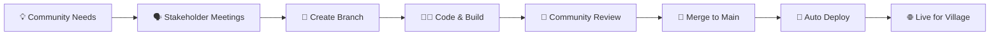

<div align="center">

# 🌟 Niha Website
### *Our First Collaborative Web Development Journey*

[](https://www.niha-chouf.com)
[](https://www.typescriptlang.org/)
[](https://vitejs.dev/)
[](https://www.niha-chouf.com)
[](#)

**Built by [Amir Merchad](https://github.com/Amir-Merchad) & [Yamen Morcel](https://github.com/Yamen-M)**

*From zero to deployed in just 10 days! 🚀*

</div>

---

## 🏘️ Community Impact

<div align="center">

### **Built for Niha Chouf Village - Lebanon 🇱🇧**

*A pro bono project to showcase our beautiful village to the world*

**Community Collaboration:** Local residents provided accurate data, historical information, and cultural insights to make this website authentic and meaningful.

</div>

---

## 🎯 Quick Overview

<table>
<tr>
<td width="50%">

### 📊 **Project Stats**
- ⏱️ **Timeline:** 10 intensive days
- 👥 **Team Size:** 2 developers
- 🌿 **Git Strategy:** Feature branching
- 🚀 **Deployment:** Fully automated
- 🌍 **Languages:** Arabic & English
- 🏘️ **Purpose:** Community service

</td>
<td width="50%">

### 🛠️ **Tech Stack**
- **TypeScript** (35.4%)
- **CSS** (38.6%)
- **HTML** (25.6%)
- **Vite + Leaflet + Prettier**

</td>
</tr>
</table>

---

## 🎨 What We Built

<div align="center">

### 🗺️ Interactive Maps • 📱 Responsive Design • ⚡ Lightning Fast • 🌍 Bilingual Support • 🏘️ Community-Driven Content

</div>

> **A digital gateway to Niha Chouf, combining modern web technologies with authentic local content**

> **First time using:** TypeScript, Vite, Team Git workflows, Automated deployment, Custom domains, **Bilingual implementation**, **Community stakeholder collaboration**

---

## 🌍 Bilingual Feature

<div align="center">

### العربية ↔️ English
**Auto language switching with dynamic content updates**

*Users can seamlessly switch between Arabic and English with all data automatically adapting to the selected language - making Niha accessible to both local and international visitors!*

</div>

---

## 🤝 Community Collaboration

<div align="center">

### **Real Data, Real Impact**

</div>

Working with local community members taught us valuable skills beyond coding:

- 📊 **Data Collection** - Gathering accurate, authentic information from residents
- 🗣️ **Stakeholder Communication** - Regular check-ins with community contributors
- 🎯 **User-Centric Design** - Building for real users with real needs
- 🏛️ **Cultural Sensitivity** - Respecting local traditions in our digital representation
- 📝 **Content Management** - Organizing and presenting community-provided information

> **"This project wasn't just about learning to code - it was about using code to serve our community."**

---

## 🏗️ Development Process



<details>
<summary><b>🌿 Our Branching Strategy (Click to expand)</b></summary>

- `main` - Production ready code
- `feature/map-integration` - Leaflet implementation
- `feature/typescript-setup` - TS configuration
- `feature/bilingual-support` - Arabic/English switching
- `feature/community-content` - Local data integration
- `feature/styling` - Responsive CSS
- `feature/deployment` - CI/CD pipeline

</details>

---

## 📚 Learning Highlights

<div align="center">

| 🎓 **What We Mastered** | 🎯 **Challenges Conquered** |
|:---|:---|
| ✅ TypeScript fundamentals | 🔥 First-time TS implementation |
| ✅ Vite build system | 🔥 Automated deployment setup |
| ✅ Git collaboration workflows | 🔥 Domain & DNS configuration |
| ✅ API integration (Leaflet) | 🔥 Bilingual data management |
| ✅ **Internationalization (i18n)** | 🔥 10-day sprint coordination |
| ✅ **Stakeholder communication** | 🔥 Community content integration |

</div>

---

## 🔄 Automated Magic

<div align="center">

### Push to Dev → Auto Build → Deploy to Hosting → Live for the Community ✨

*We built a complete CI/CD pipeline that updates our village website instantly!*

</div>

---

## 🤔 What We'd Do Differently Next Time

<div align="center">

### 💡 **Lessons Learned & Future Improvements**

</div>

<table>
<tr>
<td width="50%">

### 🎯 **Planning Phase**
- **Plan deployment early** - Include Cloudflare & custom domain setup in initial project timeline
- **Design branch strategy upfront** - Define branching rules and naming conventions from day 1
- **Allocate buffer time** - Reserve 2-3 days for deployment troubleshooting
- **Community meetings schedule** - Plan regular stakeholder check-ins

</td>
<td width="50%">

### 🛠️ **Development Workflow**
- **More granular branches** - Create smaller, focused feature branches for easier reviews
- **Daily standups** - Better coordination for 10-day sprints
- **Testing strategy** - Add unit tests from the beginning, not as an afterthought
- **Content management system** - Easier way for community to update information

</td>
</tr>
</table>

### 🚀 **Key Realizations**

> **"Building for real users changes everything - it's not just about code, it's about impact."**

- **Custom domains & Cloudflare** were more complex than expected - next time we'll research DNS, SSL, and CDN setup early
- **Git branching** felt overwhelming at first but proved invaluable - we'll use even more granular branches next time
- **Community feedback** was invaluable for UX decisions - user research is crucial
- **Pro bono work** taught us about responsibility and real-world constraints
- **TypeScript learning curve** was steep mid-project - future projects will include dedicated learning phases

### 📈 **Growth Mindset**

```typescript
const nextProject = {
  planning: "Include deployment in initial timeline",
  branching: "More feature branches, smaller commits", 
  testing: "TDD approach from day 1",
  communication: "Daily check-ins for better coordination",
  documentation: "Document decisions and challenges in real-time",
  community: "Establish clear feedback loops with stakeholders"
};
```

---

## 💡 Key Takeaway

<div align="center">

> ### *"10 days, 2 developers, 2 languages, 1 village, countless commits, and one amazing community impact!"*

**We went from HTML/CSS basics to a production-ready bilingual community website with real users and real impact.**

</div>

---

<div align="center">

### Made with ❤️ for Niha Chouf

[](https://github.com/Amir-Merchad)
[](https://github.com/Yamen-M)

**⭐ Star if our community service inspires your own projects! ⭐**

*Proudly serving our village, one commit at a time* 🏘️

</div>
